# CRAY SWMG
## CARIBOU/SONEXION @ CSCS demo
### Alpha release (03/2017)

> .

> .

> .

> .

> Matteo Chesi / Jg Piccinali

---
## TDS: Cray XC (dom)
>  Lustre layout 
Lustre implements a separation of data and metadata:
* The metadata is stored on a Metadata Target (`MDT`)
* The data is stored on a number of Object Storage Targets (`OSTs`)
*  A Metadata Server (`MDS`) serves all file system requests for metadata, 
and it looks after the MDT
* A number of Object Storage Servers (`OSS`) 
each look after several OSTs and serve requests for data on those OSTs.

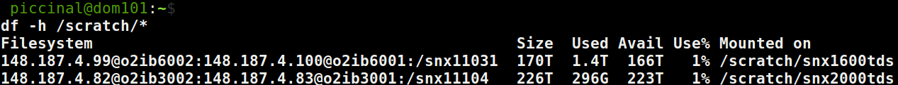

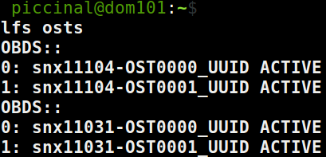

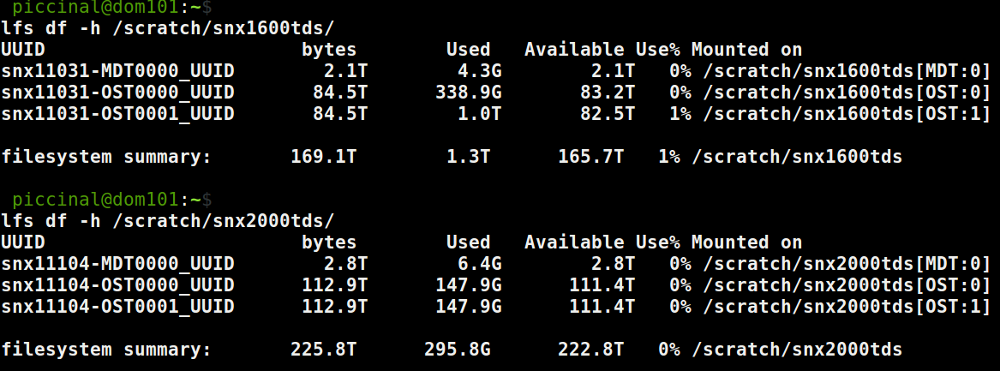

---
## TDS: Cray XC (dom)
> Lustre striping 
Lustre allows the user to have explicit control over how a file is striped
over the OSTs: chunks are sent to the different OSTs to improve disk bandwidth.

* export `MPICH_MPIIO_STATS`=1
* srun -n192 ./GNU.DOM

    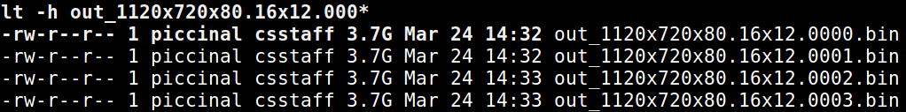

* lfs setstripe `-c 1` and lfs setstripe `-c 2`

    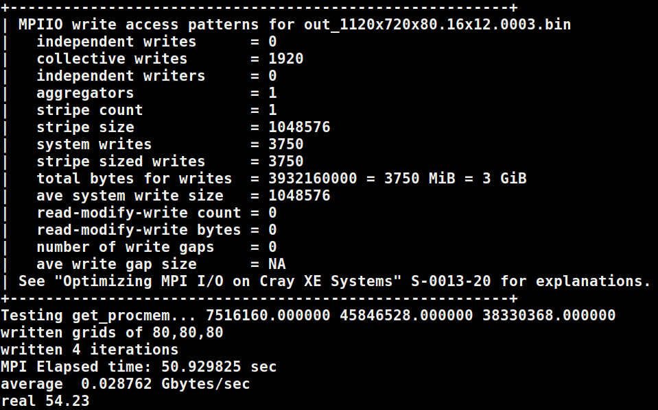
    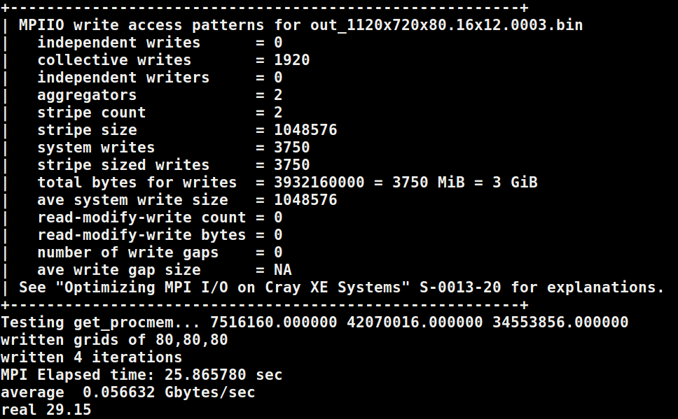

---
## [Cray Caribou](https://badile01.cscs.ch)
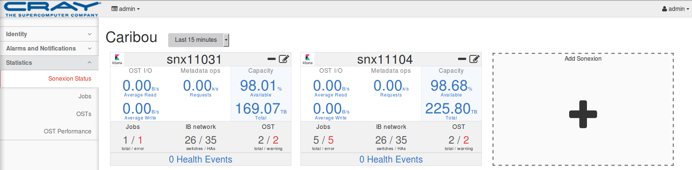

---
## kibana
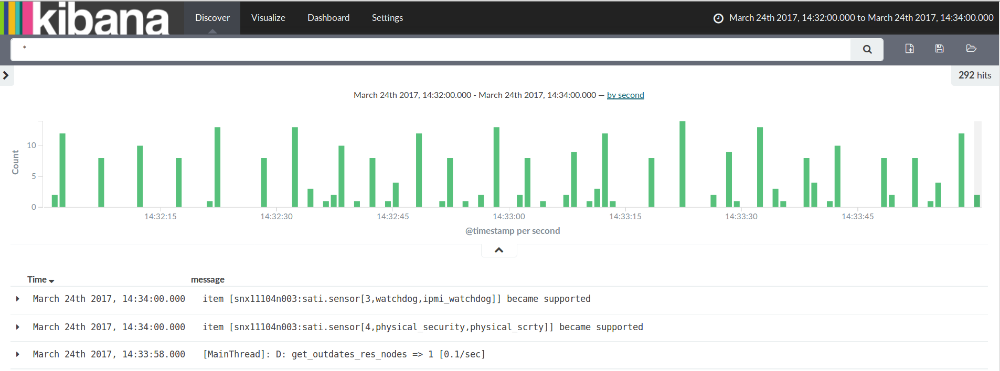

---
## [grafana:job](http://badile01.cscs.ch:3000)

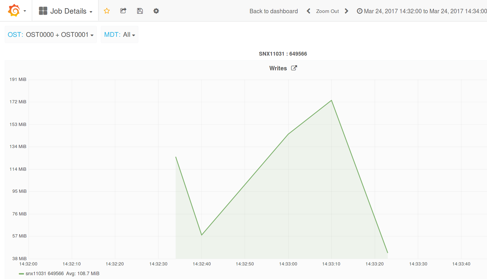
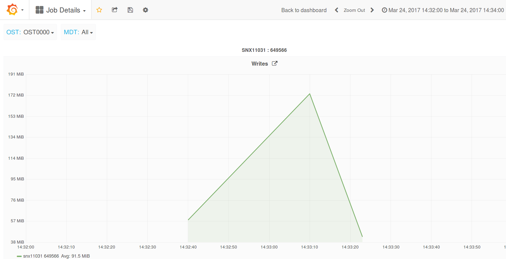
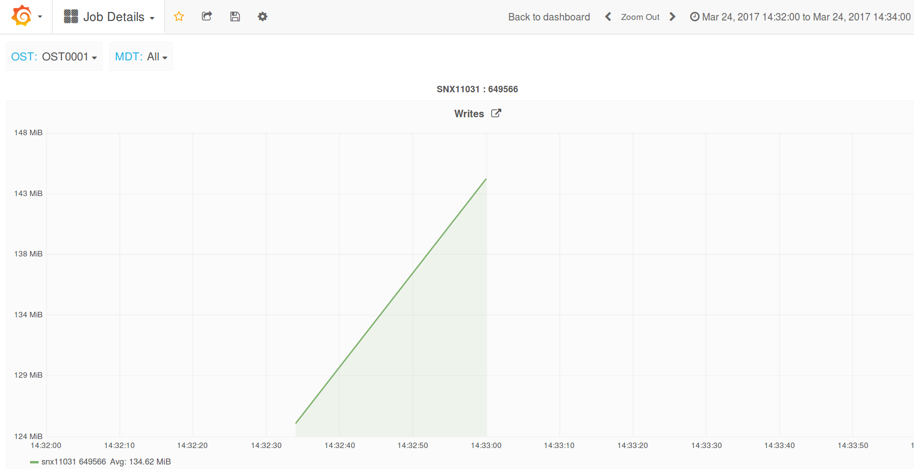

---
## [grafana:ost](http://badile01.cscs.ch:3000)
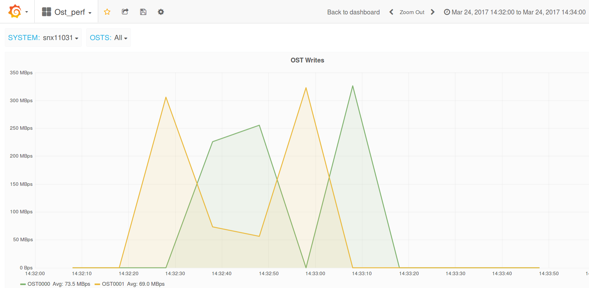
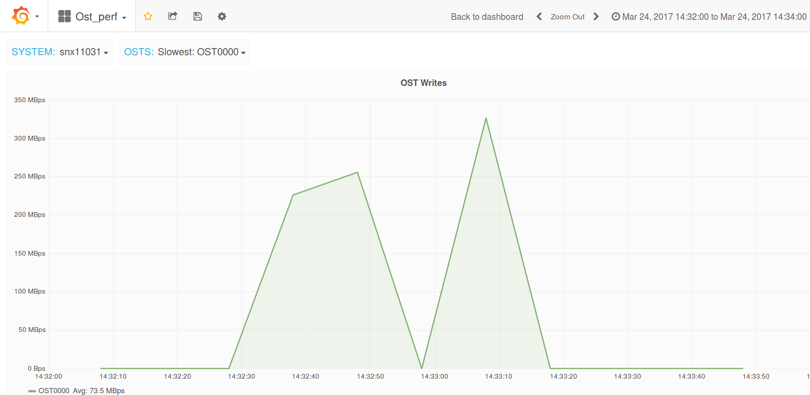
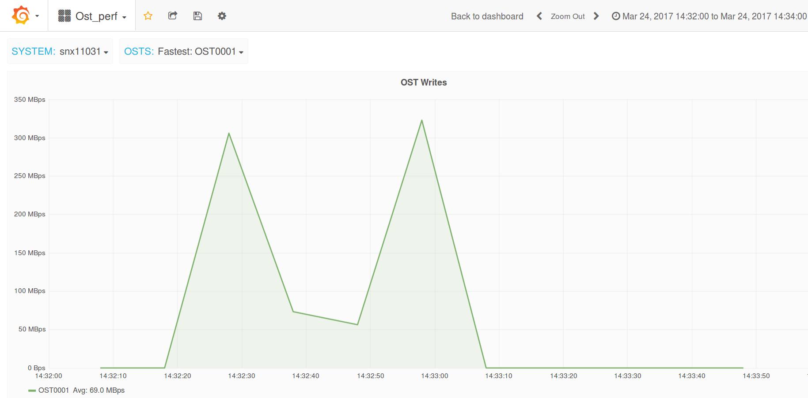

---
## [grafana:striping on 2 osts](http://badile01.cscs.ch:3000)
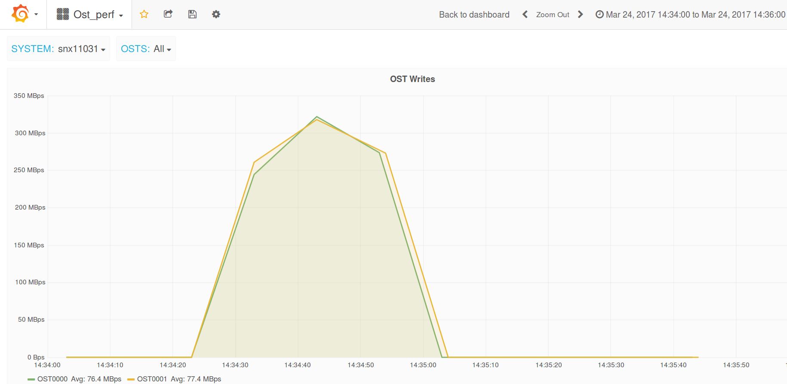
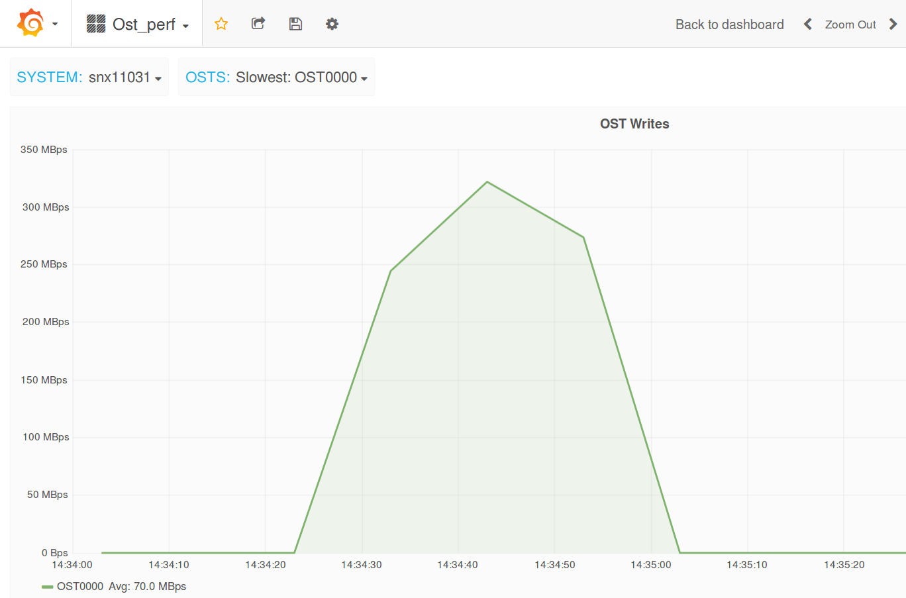
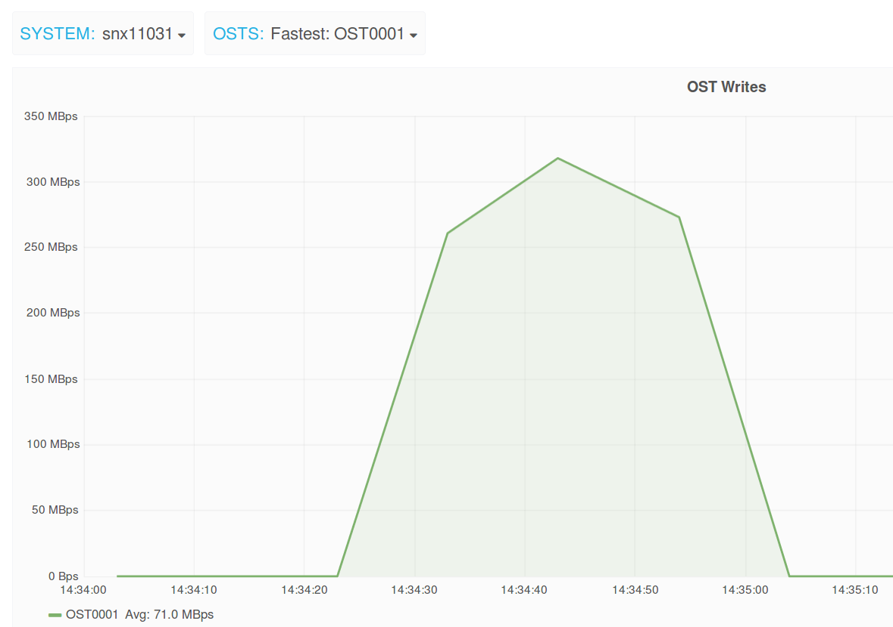

---
## CUG'17
* Tuesday May 9th / 4:40pm

`HPC Storage Operations BOF`
> Matteo Chesi (CSCS), Tina Declerck (NERSC), Oliver Treiber (ECMWF)

* Thursday May 11th / 10:30am

`Caribou : Monitoring and Metrics for Cray Sonexion Storage`
> Patricia Langer, Craig Flaskerud (Cray)

