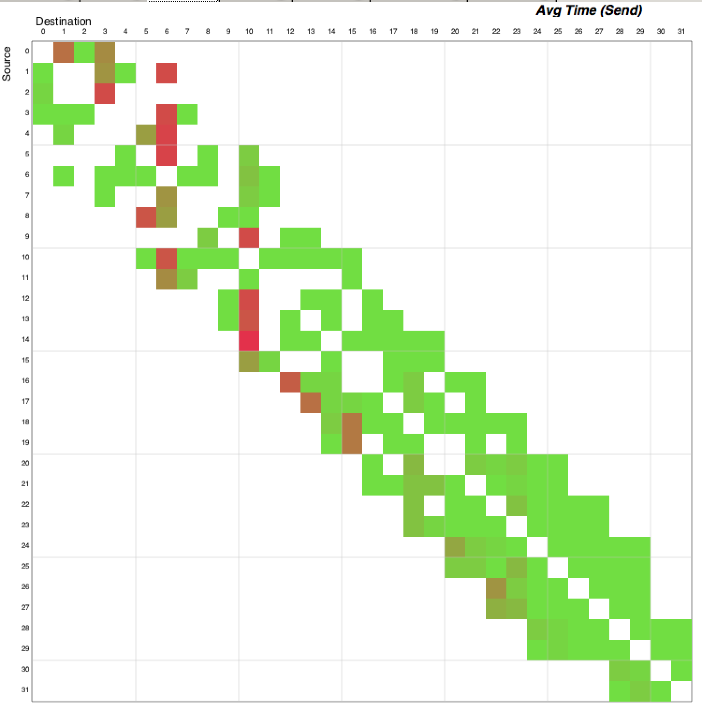

# Daint
## Intel (Oct. 2016)
### Setup:
```
module load cmake/3.5.2
module swap PrgEnv-cray PrgEnv-intel
module load cray-hdf5-parallel/1.8.16
export PPP=/project/csstaff/inputs/sphf/AEEP_Test_clr11-12
# export CRAYPE_LINK_TYPE=dynamic
```

### Compile (1):
```
XXX="cpu-$CRAY_CPU_TARGET@hsn-$CRAYPE_NETWORK_TARGET"
XXX="hdf5p-$CRAY_HDF5_PARALLEL_VERSION@$XXX"
XXX="mpi-$CRAY_MPICH2_VER@libsci-$CRAY_LIBSCI_VERSION@$XXX"
XXX="$PE_ENV-$INTEL_VERSION@prgenv-$CRAYOS_VERSION@$XXX"
XXX="daint@$XXX"
mkdir -p $XXX
cd /apps/common/UES/sandbox/jgp/sphflow/$XXX/
# daint@INTEL-15.0.1.133@prgenv-5.2.82@mpi-7.2.2
# @libsci-13.0.4@hdf5p-1.8.16@cpu-sandybridge@hsn-aries
```

---
### Compile (2):
* module list -t
```
Currently Loaded Modulefiles:
modules/3.2.10.3
nodestat/2.2-1.0502.60539.1.31.ari
sdb/1.1-1.0502.63652.4.25.ari
lustre-cray_ari_s/2.5_3.0.101_0.46.1_1.0502.8871.16.1-1.0502.21345.8.1
udreg/2.3.2-1.0502.10518.2.17.ari
ugni/6.0-1.0502.10863.8.29.ari
gni-headers/4.0-1.0502.10859.7.8.ari
dmapp/7.0.1-1.0502.11083.8.4.ari
xpmem/0.1-2.0502.64982.5.3.ari
hss-llm/7.2.0
Base-opts/1.0.2-1.0502.60680.2.4.ari
intel/15.0.1.133
craype-sandybridge
craype-network-aries
craype/2.4.0
slurm
cray-mpich/7.2.2
ddt/6.1
cray-libsci/13.0.4
totalview-support/1.1.4
totalview/8.11.0
pmi/5.0.10-1.0000.11050.0.0.ari
atp/1.8.2
PrgEnv-intel/5.2.82
```

---
### Compile (3):
```
# export INTEL_LICENSE_FILE=/apps/dora/UES/eff.lic
cmake \
-DCMAKE_Fortran_COMPILER=ftn \
-DCMAKE_C_COMPILER=cc \
-DCMAKE_CXX_COMPILER=CC \
-DJOB_CONFIG_ID=DaintIntel \
-DSPHFlow_SUPERBUILD=OFF \
-DMPI_HOME=$MPICH_DIR \
-DCRAY=ON \
-DCMAKE_VERBOSE_MAKEFILE=ON \
-DCMAKE_BUILD_TYPE=RELEASE \
-DCMAKE_Fortran_FLAGS_RELEASE="-g -O2" \
-C $PPP/compilation-cache.cmake \
../git/sph-flow.git/

-- Enable Features:
 * SPH_CALC_3D
 * SPH_KERNEL_WENDLAND
 * SPH_SOLVER_ACOUSTIC
 * SPH_LIMITER_MINMOD
 * SPH_MONOPHASIC
 * SPH_EQUATION_OF_STATE_TAIT
 * SPH_VISCOSITY_FORMULATION_MORRIS
 * SPH_VISCOSITY_MODEL_CONSTANT
 * SPH_NO_STICK_NONE
 * SPH_COUPLING_PRESSURE
 * SPH_SURFACE_TENSION_AKINCI
 * MORTON_ENCODE_LUT
 * SPH_GRID_MORTON
 * SPH_GATHER_PROBES
```

---
### Compile (4):
* make presph
* make sphflow
* make hdf2xmf

---
### Run:
```
RRR=$SCRATCH/techrev/
cp bin/* $RRR
cp $PPP/* $RRR
cd $RRR/
```

* grep deltax_ namelist.nml

```
deltax_fine_zone=2.d-3                      
! smallest DeltaX of the computational domain    :[m]
deltax_coarse_zone=2.d-3                    
! greatest DeltaX of the computational domain    :[m]
```

* grep nMaxNumericalDt namelist.nml ;grep IO_Period namelist.nml

```
IO_PeriodPolicy=2,                     
! Recording policy                           
! 1-->write according to IO_dt 
! 2-->write according to the numerical timesteps
IO_PeriodMC=10,         ! Recording period for MC
IO_PeriodRestart=10,    ! Recording period for restarts

nMaxNumericalDt=50      ! Max Number of numerical timesteps
```

* grep tMax namelist.nml
```
 tMax=1.5d0 ! Physical time (sec)
```

---
### Run:
* ~/sbatch.sh daint 5 presph 8 8 1 namelist.nml
```
Number of particles       82134
real 75.84
# => 144M  flow0.h5
```

* ~/sbatch.sh daint 10 ./sphflow 64 8 1 "namelist.nml flow0.h5"
```
istep=      4 nstep=     49 t= 0.490938E-02 s
...
Total Elapsed time:   373.306596994400      s
real 388.29
```

---
### Postproc:

* grep "Writing data in" effo_sphflow*

<p align="center"> 
<font size="1">
istep=      0 nstep=      9 t= 0.872969E-03 s<br>
Writing data in flow1.h5 at t=  0.97E-03 s<br>
istep=      1 nstep=     10 t= 0.965920E-03 s <br>
... <br>
istep=      4 nstep=     49 t= 0.490938E-02 s <br>
Writing data in flow5.h5 at t=  0.50E-02 s
</font></p>

* ls -l1h flow[0-5].h5 |awk '{print $5,$9}'
```
144M flow0.h5
138M flow1.h5
138M flow2.h5
138M flow3.h5
138M flow4.h5
138M flow5.h5
```

* ./hdf2xmf flow flow 0 5
```
flow0.xmf flow1.xmf flow2.xmf flow4.xmf flow3.xmf flow5.xmf
flow_particles.xmf flow_ghosts.xmf flow.xmf
```

---
### Postproc:
* h5dump -d '/Fluid#0/DeltaX' flow5.h5 |head -6
```
HDF5 "flow5.h5" {
DATASET "/Fluid#0/DeltaX" {
   DATATYPE  H5T_IEEE_F64LE
   DATASPACE  SIMPLE { ( 82014 ) / ( 82014 ) }
   DATA {
   (0): 0.00199119, 0.00199119, 0.00199119, 0.00199119, 0.00199119,
```

* h5dump -d '/Fluid#0/DeltaX' 2/flow5.h5 |head -6
```
HDF5 "2/flow5.h5" {
DATASET "/Fluid#0/DeltaX" {
   DATATYPE  H5T_IEEE_F64LE
   DATASPACE  SIMPLE { ( 666834 ) / ( 666834 ) }
   DATA {
   (0): 0.001, 0.001, 0.001, 0.001, 0.001, 0.001, 0.001, 0.001, 0.001, 0.001,
```

* h5dump -H flow0.h5 |grep -A2 DeltaX
```
      DATASET "DeltaX" {
         DATATYPE  H5T_IEEE_F64LE
         DATASPACE  SIMPLE { ( 671518 ) / ( 671518 ) }
```

[//]: # " * ls -1rt flow[0-9]*.h5 |tail -1 |awk -F'flow' '{print $2}' |awk -F'.h5' '{print $1}'"


---
### Scalability:

* deltax=0.001 / ptot=671518 
    * [googlechart](https://docs.google.com/spreadsheets/d/1qxyCm2Vadw2EwrApBEdJ7O_oCypVl3UiByKnfWrs-iY/edit?usp=sharing)

| cn | speedup | efficiency | timings (sec) |
|-|-|-|-|
| 1 | 1.0/1.0 | 100.0% |   2196.0 |
| 2 | 1.5/2.0 |  75.0% |   1485.4 |
| 4 | 2.4/4.0 |  60.0% |    926.0 |
| 6 | 3.0/6.0 |  50.0% |    720.1 |
| 8 | 3.7/8.0 |  46.2% |    590.2 |

    * TODO: run with more particles
[//]: # "ptot=671518; for cn in `seq 10`;do echo $ptot $cn |awk '$1/(8*$2)>9000{printf "%02dcn %05dc %06dp/c \n",$2,$2*8,$1/(8*$2)}' ;done"

---
### Cray Perftools:compile&run
* no need to rerun `cmake` 
* module load `perflite/630nogpu`
* make sphflow
```
INFO: creating the CrayPat-instrumented executable 'bin/sphflow' (sample_profile) ...OK
INFO: A maximum of 55 functions from group 'io' will be traced.
INFO: A maximum of 187 functions from group 'mpi' will be traced.
INFO: A maximum of 22 functions from group 'realtime' will be traced.
INFO: A maximum of 55 functions from group 'syscall' will be traced.
```
* Run with:
```
srun \
--ntasks=32 --ntasks-per-node=8 \
--cpus-per-task=1 --ntasks-per-core=1 \
--cpu_bind=rank --hint=nomultithread \
sphflow+ptl630 namelist.nml flow0.h5
```

* for jg only:
```
XXX="cpu-$CRAY_CPU_TARGET@hsn-$CRAYPE_NETWORK_TARGET"
XXX="hdf5p-$CRAY_HDF5_PARALLEL_VERSION@$XXX"
XXX="mpi-$CRAY_MPICH2_VER@libsci-$CRAY_LIBSCI_VERSION@$XXX"
XXX="$PE_ENV-$INTEL_VERSION@prgenv-$CRAYOS_VERSION@$XXX"
XXX="daint+$CRAYPAT_LITE-$PERFTOOLS_VERSION@$XXX"
mkdir -p $XXX
cd /apps/common/UES/sandbox/jgp/sphflow/$XXX/
```

---
### Cray Perftools:performance report
* summary
```
  CrayPat/X:  Version 6.3.0 Revision 14378 (xf 14041)  09/15/15 10:48:06
  Experiment:                  lite  lite/sample_profile
  Number of PEs (MPI ranks):     32
  Numbers of PEs per Node:        8  PEs on each of  4  Nodes
  Numbers of Threads per PE:      1
  Number of Cores per Socket:     8
  Execution start time:  Sun Oct  2 18:35:26 2016
  System name and speed:  nid00438 2601 MHz

  Avg Process Time:      891.92 secs
  High Memory:           14,926 MBytes      466.42 MBytes per PE
  MFLOPS (aggregate): 13,179.20 M/sec       411.85 M/sec per PE
  I/O Read Rate:      27.909542 MBytes/sec
  I/O Write Rate:      1.152058 MBytes/sec
  Avg CPU Energy:       538,114 joules     134,528 joules per node
  Avg CPU Power:         603.32 watts       150.83 watts per node
  Avg ACC Energy:        79,170 joules      19,792 joules per node
  Avg ACC Power:          88.76 watts        22.19 watts per node
```

---
### Cray Perftools:performance report
* Table 1:  Profile by Function
```
    Samp% |     Samp |     Imb. |  Imb. |Group
          |          |     Samp | Samp% | Function
          |          |          |       |  PE=HIDE

   100.0% | 88,510.3 |       -- |    -- |Total
  |-----------------------------------------------------------------------------
  |  60.1% | 53,180.1 |       -- |    -- |MPI
  ||----------------------------------------------------------------------------
  ||  56.8% | 50,234.8 | 14,332.2 | 22.9% |MPI_ALLREDUCE
  ||============================================================================
  |  34.4% | 30,491.6 |       -- |    -- |USER
  ||----------------------------------------------------------------------------
  ||   4.7% |  4,117.1 | 11,153.9 | 75.4% |fluxintegration_mod_mp_fluxintegration_
  ||   3.3% |  2,878.1 |  8,004.9 | 75.9% |pointinface_mod_mp_pointinface_
  ||   3.0% |  2,680.9 |     61.1 |  2.3% |freebody_updating_mod_mp_solid_nodes_faces_update_
  ||   2.5% |  2,203.4 |    329.6 | 13.4% |interaction_tvr_fluid_modinteraction_tvr_fluid_mp_tvr_fluid_fluid_
  ||   2.0% |  1,798.0 |    270.0 | 13.5% |kernel_mod_mp_kernel_gradient_
  ||   1.7% |  1,489.3 |  3,797.7 | 74.1% |interaction_tvr_fluid_mod_mp_interaction_tvr_fluid_
  ||   1.3% |  1,157.6 |  3,141.4 | 75.4% |cartesiancelldiscretization_mod_mp_cartesiancelldiscretization_
  ||   1.3% |  1,134.2 |  5,006.8 | 84.2% |normalfluxmethod_mod_mp_interactionfluxparticlepanel_
  ||============================================================================
  |   5.2% |  4,580.1 |       -- |    -- |ETC
  ||----------------------------------------------------------------------------
  ||   2.5% |  2,202.8 |    465.2 | 18.0% |H5FD_mpio_write
```

---
### Cray Perftools:performance report
* The time spent processing MPI communications is relatively high and not evenly balanced over all PEs:
```
   100.0% | 88,510.3 |Total
  |-----------------------------------------------------------------------------
  |  60.1% | 53,180.1 |MPI
  ||----------------------------------------------------------------------------
  ||  56.8% | 50,234.8 |MPI_ALLREDUCE
  |||---------------------------------------------------------------------------
  3||  54.2% | 48,003.9 |update_body_mod_mp_update_bodydt_:Update_Body.F90:line.65
  ||||--------------------------------------------------------------------------
  4|||   6.8% |  6,020.6 |ssprk83_mod_mp_update_step_ssp83_8_:SSPRK83.F90:line.613
  5|||        |          | parallelism_mp_interactionloopoverparticles_:Parallelism.F90:line.139
  6|||        |          |  tvr_mp_tvr_terms_..0:TVR.F90:line.666
  7|||        |          |   tvr_mp_advancetvr_:TVR.F90:line.98
  8|||        |          |    ssprk83_mod_mp_ssprk83_:SSPRK83.F90:line.208
  9|||        |          |     MAIN__:SphFlow.F90:line.365
  10||        |          |      main
```

---
### Cray Perftools:performance report


---
### Cray Perftools:performance report
* mpi_commmatrix:


* mpi_imbalance:


---
### Cray Perftools:performance report
* I/O (reading)
```
  Table 2:  File Input Stats by Filename
       Read |       Read |  Read Rate |     Reads |    Bytes/ |File Name[max15]
       Time |     MBytes | MBytes/sec |           |      Call | PE=HIDE
   7.890722 | 220.226452 |  27.909542 | 146,994.0 |  1,570.98 |Total
  |-----------------------------------------------------------------------------
  | 7.452483 | 208.168762 |  27.932807 |  14,382.0 | 15,177.36 |flow0.h5
  | 0.139050 |   9.969481 |  71.697264 | 128,593.0 |     81.29 |/proc/self/maps
  | 0.129423 |   0.300903 |   2.324952 |     594.0 |    531.18 |flow-temporal3.h5
  | 0.065010 |   0.585022 |   8.998955 |     160.0 |  3,834.00 |/scratch/daint/piccinal/techrev/DXJG/0.001/4/namelist.nml
  | 0.052658 |   0.300903 |   5.714254 |     594.0 |    531.18 |flow-temporal1.h5 ...
```

* I/O (writing)
```
   Write Time | Write MBytes | Write Rate |   Writes |     Bytes/ |File Name[max15]
              |              | MBytes/sec |          |       Call | PE=HIDE
   874.130541 | 1,007.048923 |   1.152058 | 90,181.0 |  11,709.42 |Total
  |-----------------------------------------------------------------------------
  | 187.259203 |   200.561073 |   1.071035 |  1,501.0 | 140,108.95 |flow2.h5
  | 181.622716 |   201.007713 |   1.106732 |  1,501.0 | 140,420.96 |flow5.h5
  | 170.072430 |   200.451958 |   1.178627 |  1,501.0 | 140,032.72 |flow1.h5
  | 168.893817 |   200.695885 |   1.188296 |  1,501.0 | 140,203.12 |flow3.h5
  | 165.982830 |   200.877327 |   1.210230 |  1,501.0 | 140,329.88 |flow4.h5
  |   0.187014 |     2.454071 |  13.122417 | 80,415.0 |      32.00 |_UnknownFile_
  |   0.049331 |     0.036266 |   0.735166 |    992.0 |      38.33 |stdout
  |   0.010634 |     0.169144 |  15.906183 |    148.0 |   1,198.38 |flow-temporal2.h5 ...
```

---
class: center, middle
# The end

---
### Scalability:
* npartInitTotal/nProcesses >= 10 000p/1c; Particles number is limited to 1,000,000
* dx=2.d-3
* ptot=82134 particles
* ptot=82134; for cn in `seq 10`;do echo $ptot $cn |awk '$1/(8*$2)>9000{printf "%02dcn %05dc %06dp/c \n",$2,$2*8,$1/(8*$2)}' ;done
```
01cn 00008c 10266p/c
```

#### ptot=671518

* dx=[  0.001,0.002,0.003,0.004,0.005,0.006 ]
* ptot=[ 671518,82134,21529, 8126, 3786,2134 ]

* [ptot=671518](https://docs.google.com/spreadsheets/d/1qxyCm2Vadw2EwrApBEdJ7O_oCypVl3UiByKnfWrs-iY/edit?usp=sharing)
* ~/linux.git/hpc/speedup.sh
* TODO: /apps/dora/sandbox/jgp/sphflow.git/dx.py
